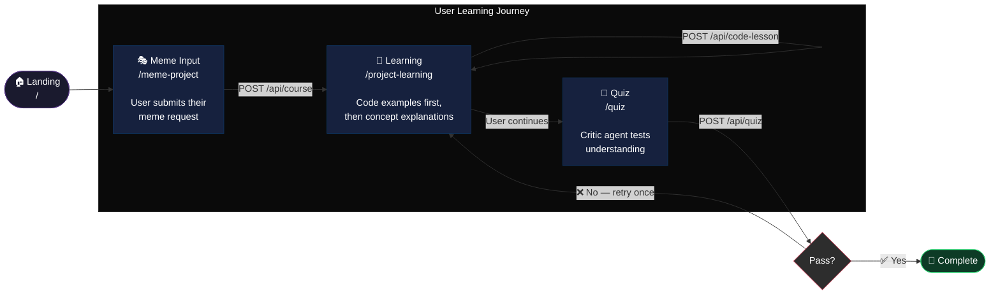
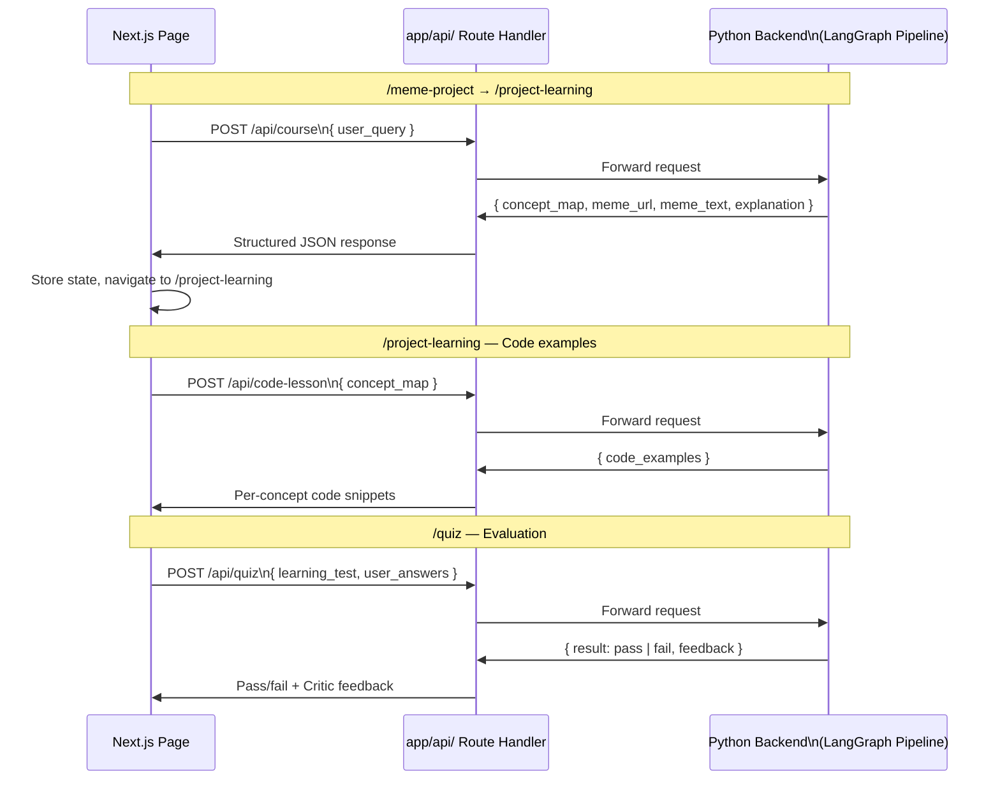

# ⚡ ignitio-ai-tutor — Frontend

> **Amazon Nova AI Hackathon** · Best Student App Category  
> The Next.js UI layer for the ignitio-ai-tutor multi-agent learning platform.  
> Built with the "tinker-first, learn-second" mechanic at its core.

---

## What It Does

The frontend is the face of the learning loop. It takes a meme idea from the user, walks them through a live AI-generated learning session, and drops them into a quiz — all driven by the multi-agent backend in real time.

No static content. Every page is generated fresh from the LangGraph pipeline on each session.

---

## Page Flow — The Learning Journey



---

## API Layer — Frontend ↔ Backend

The frontend never talks to the LangGraph agents directly. Every page talks to a Next.js route handler, which proxies to the Python FastAPI backend. This keeps the frontend decoupled from the agent internals.



---

## Tech Stack

| Layer | Technology | Why |
|---|---|---|
| Framework | Next.js 14+ (App Router) | File-based routing, server/client split |
| Language | JavaScript (`.js` / `.jsx`) | No TypeScript overhead for prototype speed |
| Styling | Tailwind CSS | Utility-first, zero context-switching |
| API Layer | Next.js Route Handlers | Clean proxy layer, no CORS issues |
| State | React `useState` / `useEffect` | Lightweight, no external state library needed |

---

## Project Structure

```
ignitio-ai-frontend/
├── app/
│   ├── api/
│   │   ├── course/
│   │   │   └── route.js          # 📡 Proxies to backend — concept_map + explanation
│   │   ├── code-lesson/
│   │   │   └── route.js          # 📡 Proxies to backend — code_examples per concept
│   │   └── quiz/
│   │       └── route.js          # 📡 Proxies to backend — learning_test + evaluation
│   │
│   ├── page.js                   # 🏠 Landing / entry point
│   │
│   ├── meme-project/
│   │   └── page.js               # 🎭 Meme input form — session start
│   │
│   ├── project-learning/
│   │   ├── page.js               # 📖 Learning page shell (server component)
│   │   ├── LearningPage.jsx      # Concept explanations — Teaching agent output
│   │   └── CodeLessonViewer.jsx  # Code viewer — tinker-first mechanic
│   │
│   ├── quiz/
│   │   ├── page.js               # 🧪 Quiz page shell (server component)
│   │   └── QuizClient.jsx        # Interactive quiz — handles answers + feedback
│   │
│   ├── layout.js                 # Root layout — shared UI wrapper
│   └── globals.css               # Global Tailwind directives
│
├── components/                   # Shared reusable UI components
├── public/                       # Static assets
├── jsconfig.json
├── next.config.mjs
├── package.json
└── CLAUDE.md
```

---

## Page → Agent Mapping

Each page in the frontend corresponds directly to a backend agent's output. The UI is a thin presentation layer over the live agent data.

| Page | Route | Backend Agent | State Fields Rendered |
|---|---|---|---|
| Meme Input | `/meme-project` | Builder Agent | Sends `user_query`, receives `meme_url`, `meme_text`, `concept_map` |
| Learning | `/project-learning` | Teaching Agent | Renders `explanation`, `code_examples` |
| Quiz | `/quiz` | Critic Agent | Renders `learning_test`, submits answers, shows `pass/fail` |

---

## The "Tinker-First" Mechanic

The `/project-learning` page intentionally shows **code before explanation**.

```
Traditional learning:          ignitio mechanic:
  1. Read concept               1. See working code (from meme you requested)
  2. See example                2. Tinker with it / read it
  3. Try it                     3. Then get the concept explained
                                4. Then get quizzed
```

`CodeLessonViewer.jsx` renders first in the layout. `LearningPage.jsx` (explanations) follows. This isn't accidental — it's the core pedagogical bet of the product.

---

## Key Conventions

All files follow these rules — no exceptions, no drift:

- **`.js` / `.jsx` only** — TypeScript is not used anywhere in this repo
- **App Router only** — all routes live under `app/`. No `pages/` directory
- **`"use client"` is explicit** — interactive components (quiz, code viewer) declare it at the top. Server components are the default
- **API routes are proxies only** — `app/api/` handlers forward requests and shape responses. Zero agent logic lives in the frontend
- **Tailwind for all styling** — no CSS Modules, no styled-components, no inline styles

---

## Setup & Run

### Prerequisites

- Node.js ≥ 18
- npm

### Install

```bash
# Clone the repo
git clone <frontend-repo-url>
cd ignitio-ai-frontend

# Install dependencies
npm install
```

### Environment Variables

```env
NEXT_PUBLIC_BACKEND_URL=http://localhost:8000   # Point to your local backend
```

### Run (Development)

```bash
npm run dev
# → http://localhost:3000
```

### Build (Production)

```bash
npm run build
npm start
```

---

## Component Roles — Quick Reference

| Component | Location | Type | Responsibility |
|---|---|---|---|
| `page.js` | `/meme-project/` | Server | Meme input form, kicks off `POST /api/course` |
| `LearningPage.jsx` | `/project-learning/` | Client | Renders concept explanations from Teaching agent |
| `CodeLessonViewer.jsx` | `/project-learning/` | Client | Renders per-concept code examples, displayed first |
| `QuizClient.jsx` | `/quiz/` | Client | Handles answer input, submits to `/api/quiz`, shows feedback |
| `route.js` × 3 | `/api/*/` | Server (Route Handler) | Proxy layer to Python backend |

---

## Deployment

| Layer | Platform |
|---|---|
| Frontend | AWS Amplify |
| Backend | AWS ECS |

The frontend is deployed to **AWS Amplify** with automatic builds on push to `main`. Environment variables are managed through the Amplify Console.

---

## Hackathon Context

Built for the **Amazon Nova AI Hackathon** — targeting the **Best Student App** category.

The frontend demonstrates:
- **Clean agent-to-UI mapping** — every page corresponds to exactly one agent's output
- **Tinker-first pedagogy** — a non-standard, evidence-backed learning sequence
- **Decoupled architecture** — the frontend knows nothing about LangGraph internals; it just consumes structured JSON
- **Production conventions** — server/client component split, route handler proxy pattern, zero TypeScript debt for prototype velocity

---

## Backend

The Python LangGraph backend repo lives here: **[→ Backend Repository](https://github.com/gurwnx222/ignitio-ai-tutor)**

The backend runs the full multi-agent pipeline — Orchestrator → Builder → Teaching → Critic — and exposes the results via FastAPI endpoints that this frontend consumes.
